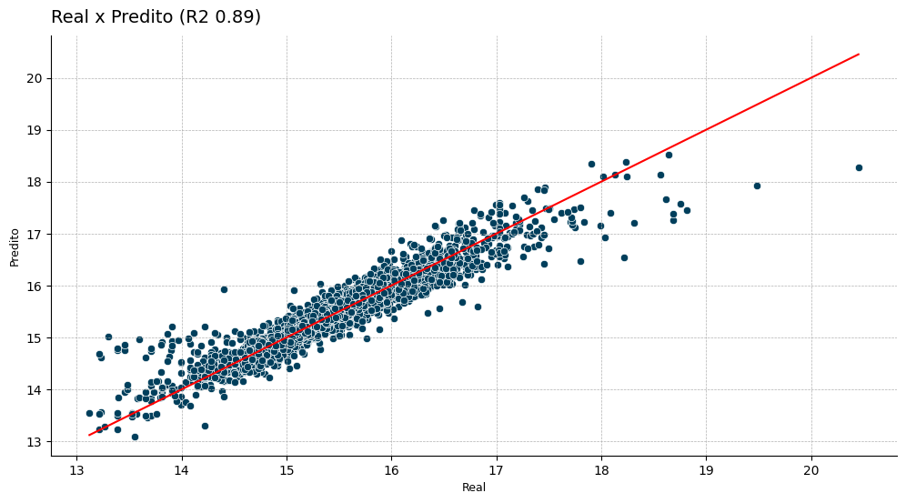
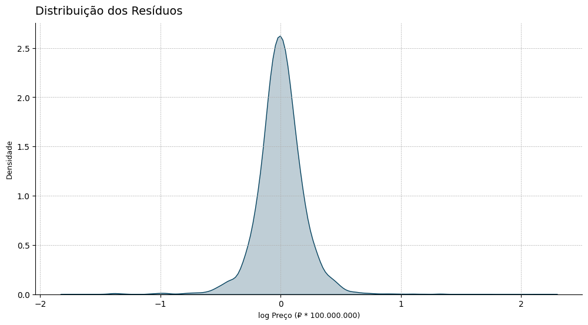
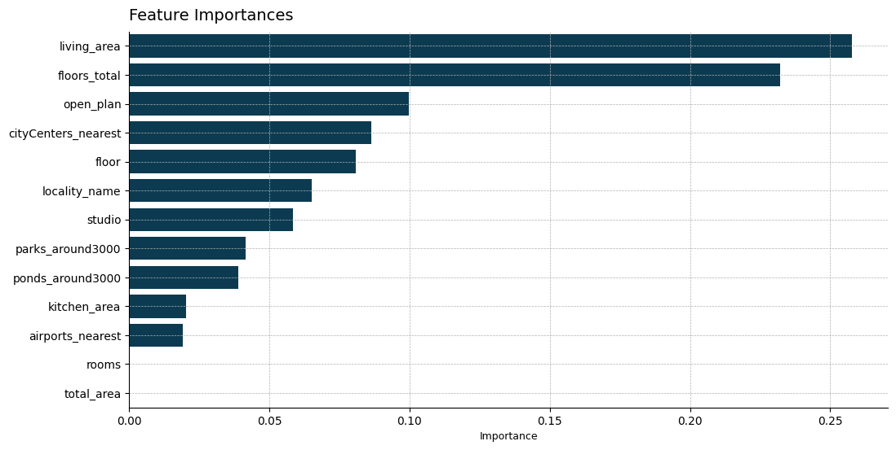

# Predição de Preço de Imóveis - Real Estate Saint Petersburg 2014 - 2019


## 📝 Introdução
São Petersburgo é a segunda maior cidade russa, o dataset Real Estate Saint Petersburg 2014 - 2019 contém uma rica quantidade de informações sobre o mercado imobiliário local. Os dados incluem variáveis que descrevem tanto os imóveis, quanto a região onde cada um está localizado. Portanto meu objetivo neste projeto foi explorar os dados para construir um modelo de machine learning capaz de predizer os preços dos imóveis na cidade. 

## 🛠️ Ferramentas 
- **Python 3.12+**
    - **Bibliotecas:** Pandas, NumPy, Scikit-learn, XGBoost, feature-engine, category-encoders, openpyxl, Optuna

## 📊 Dataset

|Coluna|Descrição|
|--|--|
|`airports_nearest`|Distância em metros para o aeroporto mais próximo|
|`balcony`| Número de sacadas|
|`ceiling_height`| Altura em metros do telhado|
|`cityCenters_nearest`| Distância até o centro da cidade em metros|
|`days_exposition`| Número de dias que o anúncio esteve ativo|
|`first_day_exposition`| Data de publicação do anúncio|
|`floor`| Total de andares do imóvel|
|`floors_total`| Total de andares no prédio onde o imóvel está localizado|
|`is_apartment`| Se é um apartamento (bool)|
|`kitchen_area`| Área da cozinha em metros quadrados|
|`last_price`| Último preço de anúncio|
|`living_area`| Área de convivência em metros quadrados|
|`locality_name`| Nome da localidade|
|`open_plan`| Se a propriedade tem um plano aberto (bool)|
|`parks_around3000`| Número de parques em um raio de 3km|
|`parks_nearest`| Distância do parque mais próximo em metros|
|`ponds_around3000`| Número de corpos de água em um raio de 3km|
|`ponds_nearest`| Distância do corpo de água mais próximo|
|`rooms`| Número de quartos|
|`studio`| Se é um apartamento do tipo studio (bool)|
|`total_area`| Área total do imóvel em metros quadrados|
|`total_images`| Número de imagens no anúncio|

## ✅ Resultados

### Métricas do modelo

|Métrica|Resultado|
|---|---|
|**MSE**| 0.0452|
|**RMSE**| 0.2126|
|**MAE**| 0.1423|
|**R2 Score**| 0.8897|

#### Sobre os resultados
Vale destacar que foi necessária uma transformação em $\log$, então pode-se ler os resultados em termo de porcentagem. O modelo utilizado foi o XGBRegressor da biblioteca XGBoost.

#### Visualizações

##### Real x Predito



##### Distribuição dos Resíduos



##### Feature Importances



## ⚙️ Como usar

### Estrutura do projeto
```plaintext
.
├── data/                  
│   ├── processed/  
|   |   └── predictions.xlsx   
│   └── raw/                  
│       └── real_estate_data.csv           
│
├── doc/                            
│   ├── img/   
|   |   ├──plots/ 
|   |   |   └── [Arquivos dos plots gerados na EDA (stprices.ipynb)]                                
|   |   ├──vadim-babenko-zjVLWDSewtE-unsplash.jpg
|   └──.gitkeep        
│
├── models/
|    └── regressor.pkl
|
├── notebook/                       
│   └── stprices.ipynb                
│
├── scr/   
|   ├── __init__.py
|   ├── predict.py                       
│   └── train.py         
│
├── .gitignore
├── poetry.lock                     
├── pyproject.toml          
├── readme.md               

```
### Instalação e uso

##### Instalar poetry
```bash
pip install poetry
```

##### Clonar repositório
```bash
git clone https://github.com/datalopes1/stpetersburg_prices.git
cd stpetersburg_prices/
```

##### Instalação das dependências
```bash
poetry install
```

##### Ativação do ambiente virtual
```bash
poetry shell
```

##### Treinamento do modelo e criação do arquivo `.pkl`
```bash
poetry run python scr/train.py
```

##### Gerar arquivo `.xlsx` com predições
```bash
poetry run python scr/predict.py
``` 

## 📞 Contato

- LinkedIn: https://www.linkedin.com/in/andreluizls1
- Portfolio: https://sites.google.com/view/datalopes1
- E-mail: datalopes1@proton.me          
