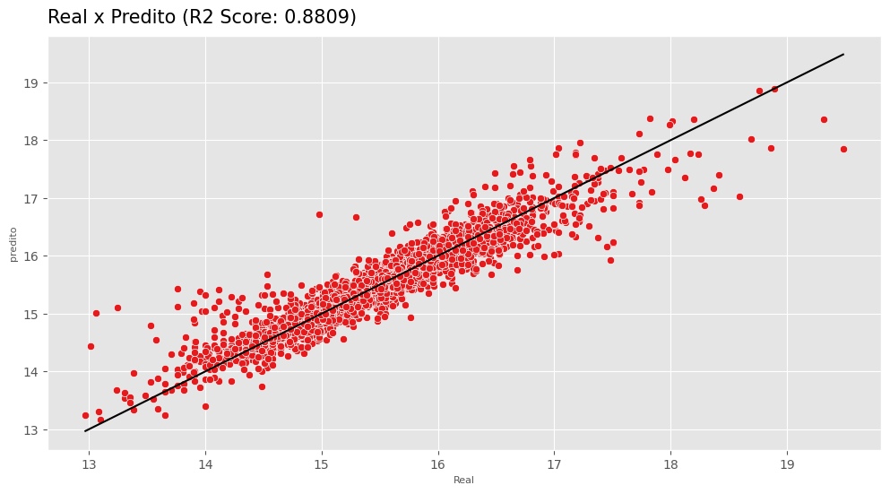
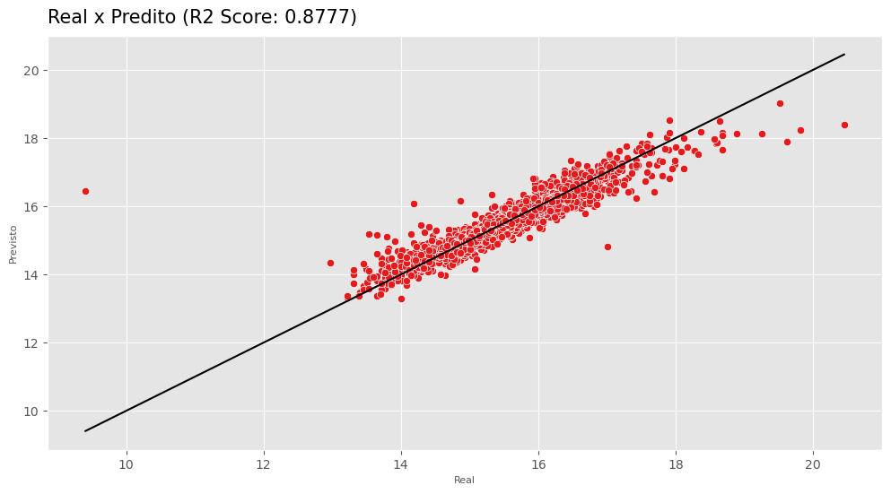
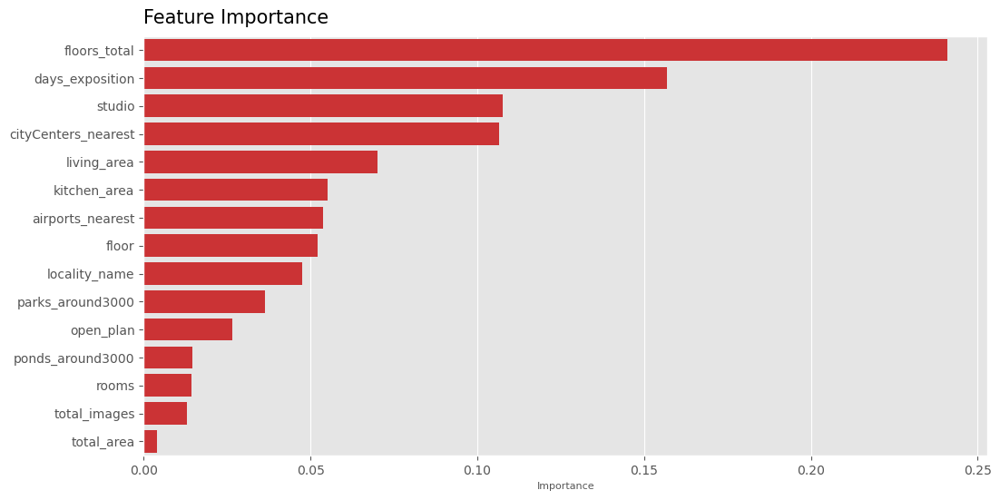

# Prevendo o Preço de Imóveis em São Petersburgo com Machine Learning - Real Estate Saint Petersburg 2014 - 2019

### Conteúdo
- [Introdução](#introdução)
- [Metas e objetivos](#metas-e-objetivos)
- [Dados](#dados)
- [Métodos e modelos](#métodos-e-modelos)
- [Resultados](#resultados)
- [Ferramentas utilizadas](#ferramentas-utilizadas)

## Introdução
O dataset Real Estate Saint Petersburg 2014 - 2019 contém informações sobre anúncios de imóveis na segunda maior cidade da Russia, São Petersburgo, sendo fonte valiosos insights sobre o mercado imobiliário na região. Os dados incluem variáveis que descrevem tanto os imóveis, quanto seus arredores e instalações próximas que podem influenciar no preço. 

## Metas e objetivos
O objetivo deste projeto é construir um modelo de machine learning capaz de  predizer o preço de imóveis em São Petersburgo. 

## Dados

|Coluna|Descrição|
|--|--|
|`airports_nearest`|Distância em metros para o aeroporto mais próximo|
|`balcony`| Número de sacadas|
|`ceiling_height`| Altura em metros do telhado|
|`cityCenters_nearest`| Distância até o centro da cidade em metros|
|`days_exposition`| Número de dias que o anúncio esteve ativo|
|`first_day_exposition`| Data de publicação do anúncio|
|`floor`| Total de andares do imóvel|
|`floors_total`| Total de andares no prédio onde o imóvel está localizado|
|`is_apartment`| Se é um apartamento (bool)|
|`kitchen_area`| Área da cozinha em metros quadrados|
|`last_price`| Último preço de anúncio|
|`living_area`| Área de convivência em metros quadrados|
|`locality_name`| Nome da localidade|
|`open_plan`| Se a propriedade tem um plano aberto (bool)|
|`parks_around3000`| Número de parques em um raio de 3km|
|`parks_nearest`| Distância do parque mais próximo em metros|
|`ponds_around3000`| Número de corpos de água em um raio de 3km|
|`ponds_nearest`| Distância do corpo de água mais próximo|
|`rooms`| Número de quartos|
|`studio`| Se é um apartamento do tipo studio (bool)|
|`total_area`| Área total do imóvel em metros quadrados|
|`total_images`| Número de imagens no anúncio|

Os dados foram originalmente encontrados no [Kaggle](https://www.kaggle.com/datasets/litvinenko630/real-estate-saint-petersburg-2014-2019/data?select=real_estate_data.csv) e também estão disponíveis na pasta [data](https://github.com/datalopes1/stpetersburg_prices/tree/main/data/raw) deste repositório.

## Métodos e modelos
####  Pré-processamento e otimizações
- Scikit-learn, Optuna, Category Encoders, Feature Engine.
#### Modelos
- XGBoost.
#### Métricas de avaliação
- Mean Squared Error, Root Mean Squared Error, Mean Absolute Error, R2 Score.

## Resultados
Um arquivo .xlsx com as previsões realizadas pelo modelo pode ser encontrado na pasta `data` do repositório.
#### Conjunto de validação
|Métrica|Resultado|
|---|---|
|MSE| 0.0503|
|RMSE| 0.2244|
|MAE| 0.1482|
|R2 Score| 0.8809|

#### Conjunto de testes
|Métrica|Resultado|
|---|---|
|MSE| 0.0557|
|RMSE| 0.2359|
|MAE| 0.1440|
|R2 Score| 0.8777|

#### Feature Importances

## Ferramentas utilizadas
